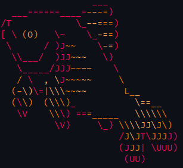

# Fish
The friendly interactive shell.

## Keybinds

| Keybind          | Command                             |
|------------------|-------------------------------------|
| Shift+LeftArrow  | move the cursor back one word       |
| Shift+RightArrow | move the cursor forward one word    |
| Alt+LeftArrow    | `prevd`                             |
| Alt+RightArrow   | `nextd`                             |
| Alt+L            | `ls`                                |
| Alt+E            | open text editor (`$EDITOR`)        |
| Alt+W            | show description                    |
| Alt+S            | prepend `sudo `                     |
| Alt+P            | append `&| less`                    |

You can also use most of the bash keybinds in fish.

## Variables

- List all variables: `set`
- Set universal variable (persistent): `set -U {name} {value}`
- Set and export variable (temporary): `set -x {name} {value}`

### `$PATH`

Fish has a special variable to store the user's added paths: `$fish_user_paths`

You can use the following commands to manipulate the variable:

- Prepend to user path: `fish_add_path {path}`
- Append to user path: `fish_add_path --append {path}`

These paths will be set permanently in fish. See `man fish_add_path` for more details.

To remove a path (e.g. the 5th), use: `set --erase --universal fish_user_paths[5]`  
You can also use the solution here: https://superuser.com/a/1212305

## Functions

### Save from shell

Use `funcsave {function_name}` to save a function or alias you entered from the interactive shell prompt.  
This will save it under `~/.config/fish/functions/{function_name}.fish`