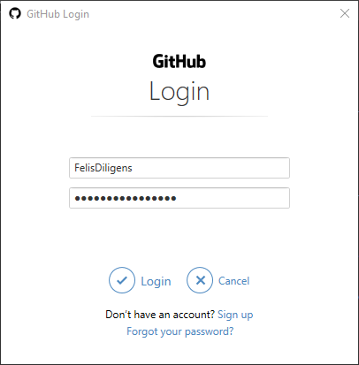
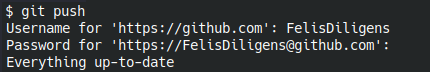

## Configuration
```
git config --global user.email "12345678+username@users.noreply.github.com"
git config --global user.name "username"
```
For E-Mails, look here: https://github.com/settings/emails


> You may need to log into GitHub the first time.  
> The window appears automatically.  
> (Please use your username, not your email. Just to be sure.)



> On Linux you need a [Personal Access Token](https://github.com/settings/tokens/new).  
> Go to `Settings` -> `Developer Settings` -> `Personal Access Tokens`,  
> create a new token and check `repo`.  
> The token can then be copied and used as a password.  
> [You can find previously created PATs here](https://github.com/settings/tokens).

## Syntax

### Relative references
Relative references are postfixes that can be appended to `HEAD`, a branch name, or a commit name (e.g. `a5a75bc`), when navigating a git tree.  
- `^`: one back (like `..`)
- `^^`: two back (like `../..`)
- `~`: one back (same as `~1`)
- `~n`: n back

You can also stack them!

Examples:
- `HEAD^`
- `master^^`
- `a5a75bc~3`
- `HEAD^^2~3`

Example commands:
- `git checkout HEAD~3` - move the HEAD (and detach it)
- `git branch -f main HEAD~3` - "move" the branch to a different commit (force)
- `git reset --hard HEAD~3` - "remove" commits and any changes in working directory (force push needed)
- `git reset --soft HEAD~3` - "remove" commits but keep changes in working directory staged (force push needed)
- `git revert HEAD` - "undo" commit by making a new commit which inverses any changes (can simply be pushed)

See the instructions below for details.

### `git describe`

Output format: `{tag_name}_{commit_count}_g<commit_hash>`

### refspec

Format: `{source}:{target}`

Example: `git push origin foo:bar`

## Instructions

### Push newly created repo
1. First, create a new remote repo on GitHub: https://help.github.com/en/articles/creating-a-new-repository  
2. Then push to remote repo:

```
git init
git branch -m master main
git add -A
git commit -m "Initial commit"
git remote add origin https://github.com/<user>/<project>.git
git push -u origin main
```

### Change `origin` URL

```bash
git remote set-url origin <new-url>
```

### Drop commits

- Remove last commit and any changes: `git reset --hard HEAD^`
  - The last two commits: `git reset --hard HEAD~2`
- Remove last commit but keep changes staged: `git reset --soft HEAD^`


### Revert commits

A safer method than dropping commits is "undoing" the changes.  
Example: `git revert HEAD`  
This will inverse the changes from the commit at `HEAD` and create a new commit in the process.

See also: https://www.atlassian.com/git/tutorials/undoing-changes/git-revert

### Squash commits

You can squash commits by running an interactive rebase.  
`git rebase -i {commit/branch/HEAD}`

Example: `git rebase -i HEAD~4`

You can also squash commits when merging.
`git merge --squash my-new-feature`

If you want to squash everything to the first commit:
`git rebase --root -i`

### Amend commit (change message)

`git commit --amend`

### Cherry pick commits to add to a branch

You can "cherry-pick" only specific commits to basically "rebase" them onto a branch.

e.g. `git cherry-pick a5a75bc cd52f12`

### Add a tag

`git tag -a v{tagname} [{commit hash}] -m {tag message}`

If you leave out the commit hash, the default is `HEAD`.

See: [Tagging](https://git-scm.com/book/en/v2/Git-Basics-Tagging)

### Track remote branch

`git branch -u origin/main [{local_branch}]`

### Merge branch and overwrite conflicts

```bash
# Overwrite changes by master in current branch:
git merge -X theirs master
```

```bash
# Keep our changes instead of those by master:
git merge -s ours master
```

You may want to read: https://howchoo.com/git/git-merge-conflicts-rebase-ours-theirs

## Troubleshooting

### Repo already created?
Try: `git pull origin main --allow-unrelated-histories`

### "Push declined due to email privacy restrictions"
```bash
git config --global user.email "123456789+username@users.noreply.github.com"
git rebase -i
git commit --amend --reset-author
git rebase --continue
git push
```
> Source: https://web.archive.org/web/20200416175035/https://github.community/t5/How-to-use-Git-and-GitHub/push-declined-due-to-email-privacy-restrictions/td-p/7660

### Under Linux: How to store password?
```bash
git config --global credential.helper store
```

### "Detected dubious ownership in repository"

Here are a few possible solutions to this issue:

#### 1. Update ownership/permissions

Under Linux:
```
chown -R <username> .git
chmod -R 666 .git
```

Under Windows:
```
takeown /f <foldername> /r /d y
```
(Run as admin; might take a while; ==in German: type `j` instead of `y`==)


#### 2. Mount NTFS partition properly! (fstab)

Add `uid=1000,gid=1000,umask=0000` to the NTFS mount options in `/etc/fstab`.

Example:
```
/dev/disk/by-id/wwn-0x50014ee2118aa10d-part1 /mnt/Elements auto nosuid,nodev,nofail,exec,noauto,x-gvfs-show,x-gvfs-name=Elements,windows_names,uid=1000,gid=1000,umask=0000 0 0
```

See: https://askubuntu.com/a/208349

#### 3. Disable warning

This is not recommended!

```
git config --global --add safe.directory '*'
```

or add to `~/.gitconfig`:

```
[safe]
	directory = *
```

https://stackoverflow.com/a/73100228

### Ignore differing modes (e.g. `old mode 100644, new mode 100755`)

Run in the git repo:
```
git config --local core.fileMode false
```

### `LF` under Windows

`git config --global core.autocrlf false`

### See also

- [Move the most recent commit(s) to a new branch with Git - Stack Overflow](https://stackoverflow.com/questions/1628563/move-the-most-recent-commits-to-a-new-branch-with-git)
- [Git HowTo: revert a commit already pushed to a remote repository](https://gist.github.com/gunjanpatel/18f9e4d1eb609597c50c2118e416e6a6)

## Differences between similar commands

### fetch and pull

- `fetch` only downloads the remote commits and branches
- `pull` downloads and integrates (merge) remote commits into local branches.

Essentially, `pull` is `fetch` and `merge` put into one command.  
For example, the following two lines are essentially identical:  
`git pull origin foo`  
`git fetch origin foo; git merge origin/foo`

### switch and checkout

Checkout can do two things: move the HEAD to a branch and detach a HEAD to point to a commit.  
Switch can ONLY move the HEAD to a branch.

## Resources
- Tutorial: [Learn Git Branching](https://learngitbranching.js.org/)
