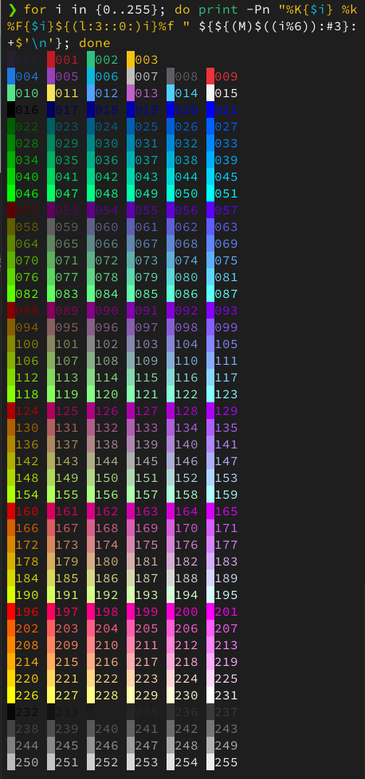

# zsh - the Z shell

## Oh My Zsh

**Requirements:**  
`zsh`, `curl`, `git`

**Installation:**
```bash
sh -c "$(curl -fsSL https://raw.githubusercontent.com/ohmyzsh/ohmyzsh/master/tools/install.sh)"
```

**Essential plugins:**
```bash
git clone https://github.com/zsh-users/zsh-autosuggestions $ZSH_CUSTOM/plugins/zsh-autosuggestions
git clone https://github.com/zsh-users/zsh-history-substring-search ${ZSH_CUSTOM:-~/.oh-my-zsh/custom}/plugins/zsh-history-substring-search
git clone https://github.com/zsh-users/zsh-syntax-highlighting.git ${ZSH_CUSTOM:-~/.oh-my-zsh/custom}/plugins/zsh-syntax-highlighting
```

**Powerlevel10k:**
```bash
git clone --depth=1 https://github.com/romkatv/powerlevel10k.git ${ZSH_CUSTOM:-$HOME/.oh-my-zsh/custom}/themes/powerlevel10k
```

Run `p10k configure` to configure.

### Themes

Replace `ZSH_THEME=...` inside `~/.zshrc` with whatever suits you.

- **Powerlevel10k:** `ZSH_THEME="powerlevel10k/powerlevel10k"`

### Plugins

> Note: make sure zsh-syntax-highlighting is the last one in the list.

```bash
plugins=(git command-not-found zoxide zsh-autosuggestions zsh-history-substring-search zsh-syntax-highlighting)
```

#### command-not-found plugin

- On **Manjaro/Arch**, install `pkgfile` and run `pkgfile -u`.
- On **Fedora**, install `PackageKit-command-not-found`.
- On **Ubuntu/Debian**, install `command-not-found`.

https://github.com/ohmyzsh/ohmyzsh/tree/master/plugins/command-not-found

## Example configuration

`~/.zshrc`
```bash
# Auto-generated by Powerlevel10k:
if [[ -r "${XDG_CACHE_HOME:-$HOME/.cache}/p10k-instant-prompt-${(%):-%n}.zsh" ]]; then
  source "${XDG_CACHE_HOME:-$HOME/.cache}/p10k-instant-prompt-${(%):-%n}.zsh"
fi
# Auto-generated by oh-my-zsh:
export ZSH="$HOME/.oh-my-zsh"

# Use Powerlevel10k theme:
ZSH_THEME="powerlevel10k/powerlevel10k"

# Use a bunch of plugins:
plugins=(git command-not-found zoxide zsh-autosuggestions zsh-history-substring-search zsh-syntax-highlighting)
source /usr/share/doc/pkgfile/command-not-found.zsh
source $ZSH/oh-my-zsh.sh

# Auto-generated by Powerlevel10k:
[[ ! -f ~/.p10k.zsh ]] || source ~/.p10k.zsh

# Your stuff follows:
# ...
```

## Powerlevel10k colors

### All available colors

Colors are specified using numbers from 0 to 255. Colors from 0 to 15 look differently in different terminals. Many terminals also support customization of these colors through color palettes (a.k.a. color schemes, or themes). Colors from 16 to 255 always look the same.

```bash
for i in {0..255}; do print -Pn "%K{$i} %k%F{$i}${(l:3::0:)i}%f " ${${(M)$((i%6)):#3}:+$'\n'}; done
```



### Change colors

Open `~/.p10k.zsh`, search for "color", "foreground" and "background" and change values of appropriate parameters.

Example:
```bash
# Ubuntu-like colors:
typeset -g POWERLEVEL9K_DIR_BACKGROUND=166
typeset -g POWERLEVEL9K_OS_ICON_FOREGROUND=202
# Manjaro-like colors:
typeset -g POWERLEVEL9K_DIR_BACKGROUND=030
typeset -g POWERLEVEL9K_OS_ICON_FOREGROUND=030
# Default
typeset -g POWERLEVEL9K_DIR_BACKGROUND=4
typeset -g POWERLEVEL9K_OS_ICON_FOREGROUND=232
```